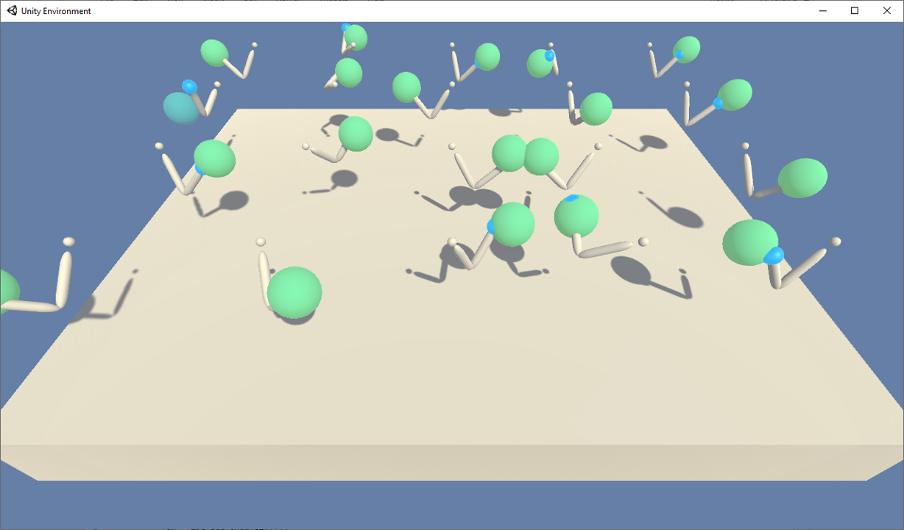
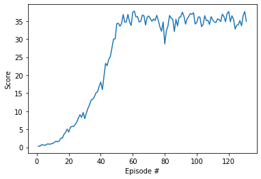
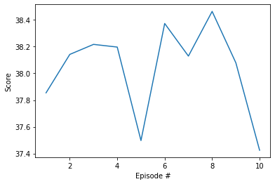

# Project 2 in Udacity Reinformcement Learning Nanodegree: Continuous Control

In this project, we are working with [Reacher](https://github.com/Unity-Technologies/ml-agents/blob/master/docs/Learning-Environment-Examples.md#reacher) environment and set up an agent that learns to control a two-armed robot to follow a target in the environemnt. This repository has the model and the code for training the agent as well as data for a trained agent.

<figure class="image" style="display:inline-block">
  
</figure>

## Introduction

In this project, there are two options to choose from. The environment can contain one single robot, or a collection of 20 robots. In the first case, the agent will control the single robot, while in the second case, the same agent is used for controlling all of them. During training the data from all of the robots are collected and used for training.

In the environment, a double-jointed arm should move to target locations, and a reward of +0.1 is provided for each step that the agent's hand is in the goal location. Thus, the goal of your agent is to maintain its position at the target location for as many time steps as possible.

The observation space consists of 33 variables corresponding to position, rotation, velocity, and angular velocities of the arm. Each action is a vector with four real numbers, corresponding to torque applicable to two joints. Every entry in the action vector should be between -1 and 1.

The files in the repository are organized as follows:

1. `continuous_control_final.ipynb`: Main notebook.
2. `ddpg_agent.py`: Agent definition, memory replay and noise definitions.
3. `model.py`: Model definitions.
4. `checkpoint_actor.pth` and `checkpoint_critic.pth`: Checkpoint data with weights for trained agent.
5. `test_final.ipynb`: Test notebook.
6. `figs`: Folder will figures used in presentations.
7. `videos`: Folder with a recorder result.
8. `Report.html`: Detailed report
9. `three_hidden_layers`: Folder containing model and agent with three hiden layers.
1. Solving the environment

For this project, we will provide you with two separate versions of the Unity environment:

- The first version contains a single agent.
- The second version contains 20 identical agents, each with its own copy of the environment.

The second version is useful for algorithms like [PPO](https://arxiv.org/pdf/1707.06347.pdf), [A3C](https://arxiv.org/pdf/1602.01783.pdf), and [D4PG](https://openreview.net/pdf?id=SyZipzbCb) that use multiple (non-interacting, parallel) copies of the same agent to distribute the task of gathering experience.

## Getting Started

### 1. Setting up the Python environment

If you have the environment set up ready for the first project, [Navigation](https://github.com/udacity/deep-reinforcement-learning/tree/master/p1_navigation), you should be good to go. Otherwise, you need to install the required libraries and packages. A suggesiton would be to use Anaconda. If you do not have it, you can install it from [here](https://www.anaconda.com/products/individual) and then folloe the steps below:

```
conda create --name unity python=3.6
conda activate unity

pip install unityagents
pip install mlagents
pip install gym
pip install h5py
pip install Pillow
```

### 2. Downloading the Unity environment

As mentioned, in this project, I chose the second option, with 20 agents. To run the code in this positoy, you need to have the 2nd version with 20 robots. From the list below, choose the right version for your operative system:

- [Linux](https://s3-us-west-1.amazonaws.com/udacity-drlnd/P2/Reacher/Reacher_Linux.zip)
- [Mac OSX](https://s3-us-west-1.amazonaws.com/udacity-drlnd/P2/Reacher/Reacher.app.zip)
- [Windows (32-bit)](https://s3-us-west-1.amazonaws.com/udacity-drlnd/P2/Reacher/Reacher_Windows_x86.zip)
- [Windows (64-bit](https://s3-us-west-1.amazonaws.com/udacity-drlnd/P2/Reacher/Reacher_Windows_x86_64.zip)

If you are on Windows and are not sure which version you have, you can check [this link](https://support.microsoft.com/en-us/help/827218/how-to-determine-whether-a-computer-is-running-a-32-bit-version-or-64).

Note that the code in this repository has been tested on a 64-bit Windows.

## Solving the environment

### 1. Training the agent

To train the agent, after that the above steps are taken, you start jupyter notebook and from the clone of this repository, you open the notebook called `continuous_control_final.ipynb` and run all the cells. Note that the Unity environment will be run in training mode with graphics off.

The notebook imports the agent from `ddpg_agent.py` which in turn uses the definition from `model.py`. The agent will have the default network defined in the model, with two hidden layers and 128 neurons in each.

If all the steps above are correctly taken, the training should start and the target, average 30 should be reached after less than 150 episodes. Once the training is complete, the environment will be run another 10 steps and results will be shown in a graph. You should be able to see two graphs similar to these:

<br/><br/>

<figure class="image" style="display:inline-block">
    <center> Training with noise added to actions </center>
  
</figure>

<figure class="image" style="display:inline-block">
    <center> Test without noise </center>
  
</figure>

The weights are stored every 10 steps in two checkpoint files `checkpoint_actor.pth` and `checkpoint_critic.pth`.

### 2. Testing the agent

To test the agent with the recorded checkpoint files, you open and run all cells in the notebook called `test_final.ipynb`. This time, the environment will be run once with graphics on and you will be able to see how well the agent works. [Here](./videos) you find an mp4 recording that you can download and watch.

### 3. Changing the hyper parameters

If you wish to make changes in the hyper parameters, there are two areas to visit. In cell number 5 in `continuous_control_final.ipynb` you can change the below parameters:

```Python
BUFFER_SIZE = int(1e5)  # replay buffer size
BATCH_SIZE = 128        # minibatch size
GAMMA = 0.99            # discount factor
TAU = 1e-3              # for soft update of target parameters
LR_ACTOR = 1e-4         # learning rate of the actor 
LR_CRITIC = 1e-4        # learning rate of the critic

NOISE_DECAY = 1         # Noise decay rate - Added, but not used

from ddpg_agent import Agent
agent = Agent(state_size, action_size, LR_ACTOR, LR_CRITIC, BATCH_SIZE, BUFFER_SIZE, NOISE_DECAY, 13)

print("Actor network:", agent.actor_local)
print("Critic network:", agent.critic_local)
```

If you want to change the size of the hidden layers in the network, you visit `ddpg_agent.py` and add the sizes of the layers like:

```Python
# Actor Network (w/ Target Network)

fc1 = 64
fc2 = 128     
self.actor_local = Actor(state_size, action_size, random_seed, fc1_units=fc1, fc2_units=fc2).to(device)
self.actor_target = Actor(state_size, action_size, random_seed*2, fc1_units=fc1, fc2_units=fc2).to(device)
self.actor_optimizer = optim.Adam(self.actor_local.parameters(), lr=lr_actor)

# Critic Network (w/ Target Network)

fc1 = 64
fc2 = 128     
self.critic_local  = Critic(state_size, action_size, random_seed*3, fcs1_units=fc1, fc2_units=fc2).to(device)
self.critic_target = Critic(state_size, action_size, random_seed*4, fcs1_units=fc1, fc2_units=fc2).to(device)
self.critic_optimizer = optim.Adam(self.critic_local.parameters(), lr=lr_critic)
```

If you wish to have a different network than two hidden layers, you need to visit `model.py`. You can see how it can be done by looking at the model with 3 hidden layes in [this folder](./three_hidden_layers).
